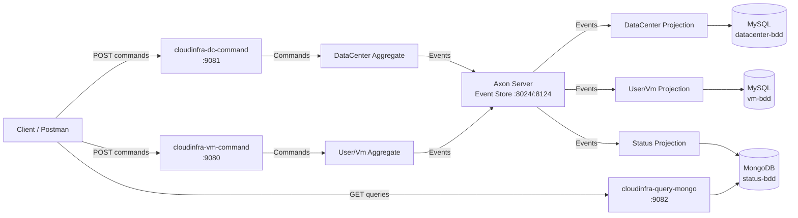

# 🖥️ Cloud Infrastructure Manager

> An event-driven microservices platform for managing cloud infrastructure — Data Centers, Servers, VMs & Users — built with **CQRS & Event Sourcing**.


## 📖 What is it?

**Cloud Infrastructure Manager** is a microservices platform that simulates managing a cloud provider's infrastructure:

- 🏢 **Data Centers** have a total RAM capacity (GB), a geographic **region** (`eu-west-1`, `us-east-1`, …) and host **Servers**.
- 🖧 **Servers** have a hardware configuration (CPU, RAM, disk), a **lifecycle state** (`ACTIVE` / `DECOMMISSIONED`) and host **VMs**.
- 💻 **VMs** belong to **Users**, have a **lifecycle state** (`RUNNING` / `STOPPED`) and consume RAM from their server only while running.
- 📊 The system tracks, in real time, how much RAM remains available at every level and **which VMs are deployed on which server**.

Every operation — creating a data center, provisioning a server, deploying a VM — is captured as an **immutable event**, providing a complete audit trail, fast read models, and fully decoupled services.

## 🏗️ Architecture

The project follows the **CQRS (Command Query Responsibility Segregation)** pattern with **Event Sourcing**, orchestrated by the **Axon Framework**:



### Why CQRS & Event Sourcing?

| Concern | How this project answers it |
|---|---|
| **Audit trail** | Every state change is an immutable event stored in Axon Server — the full history of the infrastructure can be replayed. |
| **Independent scaling** | Write side (command services) and read side (query service) scale independently based on load. |
| **Polyglot persistence** | MySQL for consistent, transactional write models; MongoDB for fast, denormalized read models. |
| **Loose coupling** | Services communicate **only** through events — the query service never calls the command services directly. |

## 🧩 Modules

| Module | Role | Persistence | Port |
|---|---|---|---|
| `cloudinfra-core-api` | Shared contracts: Commands, Events, DTOs, Exceptions | — | — |
| `cloudinfra-dc-command` | Write side: Data Centers & Servers aggregates | MySQL | 9081 |
| `cloudinfra-vm-command` | Write side: Users & VMs aggregates | MySQL | 9080 |
| `cloudinfra-query-mongo` | Read side: live status projections | MongoDB | 9082 |

## 🛠️ Tech Stack

- **Java 21**, **Spring Boot 3.4.5**, **Axon Framework 4.11.1** (CQRS + Event Sourcing)
- **Axon Server** — Event store & message bus
- **MySQL** — Write-side persistence (JPA/Hibernate)
- **MongoDB** — Read-side projections (Spring Data MongoDB)
- **Docker Compose** — Full local infrastructure with healthchecks
- **Lombok**, **Maven Wrapper**

## 🚀 Quick Start

The entire platform (Axon Server, MySQL, MongoDB, and all 3 Spring Boot services) can be started with a single command thanks to Docker Compose healthchecks.

### 1. Start the infrastructure & services

```bash
# Build and start everything in the background
docker compose up -d --build
```
*(Wait ~60 seconds for MySQL and Axon Server to become healthy before sending requests).*

### 2. Try the full CQRS flow

```bash
# 1. Create a data center with 128 GB RAM in region eu-west-1
curl -X POST http://localhost:9081/command/datacenter \
  -H "Content-Type: application/json" \
  -d '{"idDataCenter": 1, "city": "Paris", "capacity": 128, "region": "eu-west-1"}'

# 2. Provision a server with 64 GB RAM inside it
curl -X POST http://localhost:9081/command/datacenter/1/server \
  -H "Content-Type: application/json" \
  -d '{"idServer": 10, "configuration": {"cpu": 16, "ram": 64, "disk": 512}}'

# 3. Create a user
curl -X POST http://localhost:9080/command/user \
  -H "Content-Type: application/json" \
  -d '{"idUser": 100, "name": "Alice", "email": "alice@example.com"}'

# 4. Deploy a VM on the server (consumes 16 GB RAM)
curl -X POST http://localhost:9080/command/user/100/vm \
  -H "Content-Type: application/json" \
  -d '{"idVm": 1000, "idServer": 10, "configuration": {"cpu": 4, "ram": 16, "disk": 64}}'

# 5. Query the live status (Read Model via MongoDB)
curl http://localhost:9082/query/datacenters/1
# → {"idDataCenter":1, "city":"Paris", "region":"eu-west-1", "capacity":128, 
#    "nbServers":1, "nbVms":1, "nbRunningVms":1, "nbStoppedVms":0, "remainingRam":48}
```

> 💡 **Tip:** A ready-made **Postman collection** is included in the root directory: `cloud-infrastructure-manager.postman_collection.json`.

## 📡 API Overview

### Command side (Write Model)

| Method | Endpoint | Service Port | Description |
|---|---|---|---|
| `POST` | `/command/datacenter` | 9081 | Create a data center (`idDataCenter`, `city`, `capacity`, `region`) |
| `POST` | `/command/datacenter/{idDataCenter}/server` | 9081 | Provision a server in a data center |
| `DELETE` | `/command/datacenter/{idDataCenter}/{idServer}` | 9081 | Remove a server |
| `POST` | `/command/datacenter/{id}/servers/{srvId}/decommission` | 9081 | Decommission a server (refused if it still hosts VMs) |
| `POST` | `/command/user` | 9080 | Create a user (`idUser`, `name`, `email`) |
| `POST` | `/command/user/{userid}/vm` | 9080 | Deploy a VM for a user |
| `DELETE` | `/command/user/{userid}/{idvm}` | 9080 | Delete a VM |
| `POST` | `/command/user/{id}/vms/{vmId}/stop` | 9080 | Stop a RUNNING VM (frees its RAM) |
| `POST` | `/command/user/{id}/vms/{vmId}/start` | 9080 | Start a STOPPED VM (re-allocates its RAM) |

### Query side (Read Model - MongoDB)

| Method | Endpoint | Service Port | Description |
|---|---|---|---|
| `GET` | `/query/datacenters` | 9082 | Status of all data centers (capacity, servers, VMs, remaining RAM) |
| `GET` | `/query/datacenters/{idDataCenter}` | 9082 | Status of one specific data center |
| `GET` | `/query/servers` | 9082 | All servers tracked in the read model |
| `GET` | `/query/servers/{idServer}` | 9082 | Server details including remaining RAM |
| `GET` | `/query/datacenters/{idDataCenter}/servers` | 9082 | All servers of a given data center |
| `GET` | `/query/servers/{id}` | 9082 | Full server status including the list of hosted VM IDs |
| `GET` | `/query/servers/{id}/vms` | 9082 | List of VMs deployed on a specific server |

*(Note: The command services also expose convenience `/query/...` endpoints on ports 9080/9081 to read directly from their local MySQL state, but the primary CQRS read model is served by port 9082).*

## 📚 API Documentation (Swagger)

Each service exposes an interactive Swagger UI when running:

| Service | Swagger UI URL |
|---|---|
| `cloudinfra-dc-command` | http://localhost:9081/swagger-ui.html |
| `cloudinfra-vm-command` | http://localhost:9080/swagger-ui.html |
| `cloudinfra-query-mongo` | http://localhost:9082/swagger-ui.html |

## ✅ Business Rules & Invariants

- A data center's capacity must be positive, and a **region is required**.
- A server's configuration must have positive CPU/RAM/disk values.
- **A server cannot be provisioned if the data center's remaining RAM is insufficient** → Returns `409 Conflict`.
- A VM must be attached to an existing server and have a valid configuration.
- **Only a RUNNING VM can be stopped; only a STOPPED VM can be started** → Returns `400 Bad Request`.
- **A server cannot be decommissioned while it still hosts VMs** → Returns `400 Bad Request`.
- Deleting a non-existent server/VM/user → Returns `409 Conflict`.

## 📁 Project Structure

```text
cloud-infrastructure-manager/
├── cloudinfra-core-api/          # Shared contracts: Commands, Events, DTOs, Exceptions
├── cloudinfra-dc-command/        # Write side: DataCenter & Server aggregates
├── cloudinfra-vm-command/        # Write side: User & VM aggregates
├── cloudinfra-query-mongo/       # Read side: Status projections (MongoDB)
├── docker-compose.yml            # Unified infrastructure (Axon, MySQL, MongoDB, Apps)
└── cloud-infrastructure-manager.postman_collection.json
```

## 🧪 Testing

The aggregates are tested with **Axon's `AggregateTestFixture`** — pure unit tests that verify the command → event contract of the event-sourced domain, with no external infrastructure required:

```bash
cd cloudinfra-dc-command && ./mvnw test    # Validates capacity rules, lifecycle states
cd cloudinfra-vm-command && ./mvnw test    # Validates VM deployment and user rules
```

## 📚 Key Concepts Demonstrated

- **CQRS** — Strict separation of command and query models, each with its own storage.
- **Event Sourcing** — Aggregates are rebuilt from their immutable event history, not database rows.
- **Event-Driven Microservices** — Services react to events on the bus; they never call each other via HTTP/RPC.
- **Polyglot Persistence** — MySQL for transactional writes, MongoDB for optimized reads.
- **Domain-Driven Design** — Rich aggregates, entities, and value objects (`Configuration`) enforcing business invariants at the boundary.
- **Global Exception Handling** — Clean, standardized JSON error responses for all business rule violations.

## 📄 License

MIT — see [LICENSE](LICENSE).
