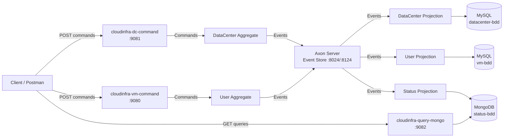

# 🖥️ Cloud Infrastructure Manager

> An event-driven microservices platform for managing cloud infrastructure — Data Centers, Servers, VMs & Users — built with **CQRS & Event Sourcing**.


## 📖 What is it?

**Cloud Infrastructure Manager** is a microservices platform that simulates managing a cloud provider's infrastructure:

- 🏢 **Data Centers** have a total RAM capacity (GB), a geographic **region** (`eu-west-1`, `us-east-1`, …) and host **Servers**
- 🖧 **Servers** have a hardware configuration (CPU, RAM, disk), a **lifecycle state** (`ACTIVE` / `DECOMMISSIONED`) and host **VMs**
- 💻 **VMs** belong to **Users**, have a **lifecycle state** (`RUNNING` / `STOPPED`) and consume RAM from their server only while running
- 📊 The system tracks, in real time, how much RAM remains available at every level and **which VMs are deployed on which server**

Every operation — creating a data center, provisioning a server, deploying a VM — is captured as an **immutable event**, providing a complete audit trail, fast read models, and fully decoupled services.

## 🏗️ Architecture

The project follows the **CQRS (Command Query Responsibility Segregation)** pattern with **Event Sourcing**, orchestrated by the **Axon Framework**:



### Why CQRS & Event Sourcing?

| Concern | How this project answers it |
|---|---|
| **Audit trail** | Every state change is an immutable event stored in Axon Server — the full history of the infrastructure can be replayed |
| **Independent scaling** | Write side (command services) and read side (query service) scale independently |
| **Polyglot persistence** | MySQL for consistent write models, MongoDB for fast, denormalized read models |
| **Loose coupling** | Services communicate **only** through events — the query service never calls the command services |

## 🧩 Modules

| Module | Role | Persistence | Port |
|---|---|---|---|
| `cloudinfra-core-api` | Shared contracts: Commands, Events, DTOs | — | — |
| `cloudinfra-dc-command` | Write side: Data Centers & Servers | MySQL | 9081 |
| `cloudinfra-vm-command` | Write side: Users & VMs | MySQL | 9080 |
| `cloudinfra-query-mongo` | Read side: live status projections | MongoDB | 9082 |

## 🛠️ Tech Stack

- **Java 21**, **Spring Boot 3.4.5**, **Axon Framework 4.11.1** (CQRS + Event Sourcing)
- **Axon Server** — event store & message bus
- **MySQL** — write-side persistence (JPA/Hibernate)
- **MongoDB** — read-side projections
- **Docker Compose** — full local infrastructure
- **Lombok**, **Maven Wrapper**

## 🚀 Quick Start

### 1. Start the infrastructure

```bash
# Axon Server (event store)
docker compose -f axon-docker-compose.yml up -d

# MySQL + phpMyAdmin
docker compose -f mysql-docker-compose.yml up -d

# MongoDB
docker compose -f mongo-docker-compose.yml up -d
```

### 2. Build & run the services

```bash
# Build everything (core-api first, it's a shared library)
cd cloudinfra-core-api && ./mvnw clean install -DskipTests && cd ..

cd cloudinfra-dc-command && ./mvnw spring-boot:run &      # port 9081
cd cloudinfra-vm-command && ./mvnw spring-boot:run &      # port 9080
cd cloudinfra-query-mongo && ./mvnw spring-boot:run &     # port 9082
```

### 3. Try the full flow

```bash
# 1. Create a data center with 64 GB RAM in region eu-west-1
curl -X POST http://localhost:9081/command/datacenter \
  -H "Content-Type: application/json" \
  -d '{"idDataCenter": 1, "city": "Paris", "capacity": 64, "region": "eu-west-1"}'

# 2. Provision a server with 32 GB RAM inside it
curl -X POST http://localhost:9081/command/datacenter/1/server \
  -H "Content-Type: application/json" \
  -d '{"idServer": 10, "configuration": {"cpu": 16, "ram": 32, "disk": 512}}'

# 3. Create a user
curl -X POST http://localhost:9080/command/user \
  -H "Content-Type: application/json" \
  -d '{"idUser": 100, "name": "Alice", "email": "alice@example.com"}'

# 4. Deploy a VM on the server
curl -X POST http://localhost:9080/command/user/100/vm \
  -H "Content-Type: application/json" \
  -d '{"idVm": 1000, "idServer": 10, "configuration": {"cpu": 4, "ram": 8, "disk": 64}}'

# 5. Stop the VM (frees its 8 GB of RAM)
curl -X POST http://localhost:9080/command/user/100/vms/1000/stop

# 6. Query the live status (read model, MongoDB)
curl http://localhost:9082/query/datacenters
# → {"idDataCenter": 1, "region": "eu-west-1", "capacity": 64, "nbServers": 1, "nbVms": 1,
#    "nbRunningVms": 0, "nbStoppedVms": 1, "remainingRam": 32}

# 7. Which VMs are on server 10?
curl http://localhost:9082/query/servers/10/vms
# → [{"idVm": 1000}]
```

A ready-made **Postman collection** is included: `cloud-infrastructure-manager.postman_collection.json`.

## 📡 API Overview

### Command side (write)

| Method | Endpoint | Description |
|---|---|---|
| POST | `/command/datacenter` | Create a data center (with `region`) |
| POST | `/command/datacenter/{id}/server` | Provision a server in a data center |
| DELETE | `/command/datacenter/{id}/{idServer}` | Remove a server |
| POST | `/command/datacenter/{id}/servers/{srvId}/decommission` | Decommission a server (refused if it still hosts VMs) |
| POST | `/command/user` | Create a user |
| POST | `/command/user/{id}/vm` | Deploy a VM for a user |
| DELETE | `/command/user/{id}/{idVm}` | Delete a VM |
| POST | `/command/user/{id}/vms/{vmId}/stop` | Stop a RUNNING VM (frees its RAM) |
| POST | `/command/user/{id}/vms/{vmId}/start` | Start a STOPPED VM (re-allocates its RAM) |

### Query side (read)

| Method | Endpoint | Description |
|---|---|---|
| GET | `/query/datacenters` | Status of all data centers (capacity, servers, VMs, remaining RAM) |
| GET | `/query/datacenters/{id}` | Status of one data center |
| GET | `/query/datacenters/{id}/servers` | Servers of a data center (with remaining RAM) |
| GET | `/query/servers` | All servers |
| GET | `/query/servers/{id}` | One server |
| GET | `/query/servers/{id}` | Server details incl. hosted VM IDs |
| GET | `/query/servers/{id}/vms` | VMs deployed on a server |
| GET | `/query/users` | All users |
| GET | `/query/users/{id}` | One user |
| GET | `/query/vms` | All VMs |
| GET | `/query/vms/{id}` | One VM |

## 📚 API Documentation (Swagger)

Each service exposes an interactive Swagger UI when running:

| Service | Swagger UI |
|---|---|
| cloudinfra-dc-command | http://localhost:9081/swagger-ui.html |
| cloudinfra-vm-command | http://localhost:9080/swagger-ui.html |
| cloudinfra-query-mongo | http://localhost:9082/swagger-ui.html |

## ✅ Business Rules

- A data center's capacity must be positive and a **region is required**
- A server's configuration must have positive CPU/RAM/disk values
- **A server cannot be provisioned if the data center's remaining RAM is insufficient** → `409 Conflict`
- A VM must be attached to an existing server and have a valid configuration
- **Only a RUNNING VM can be stopped; only a STOPPED VM can be started** → `400 Bad Request`
- **A server cannot be decommissioned while it still hosts VMs** → `400 Bad Request`
- Deleting a non-existent server/VM → `409 Conflict`

## 📁 Project Structure

```
cloud-infrastructure-manager/
├── cloudinfra-core-api/          # Shared commands, events, DTOs
├── cloudinfra-dc-command/        # Write side: DataCenter & Server aggregates
├── cloudinfra-vm-command/        # Write side: User & VM aggregates
├── cloudinfra-query-mongo/       # Read side: status projections
├── axon-docker-compose.yml       # Axon Server
├── mysql-docker-compose.yml      # MySQL + phpMyAdmin
├── mongo-docker-compose.yml      # MongoDB
└── cloud-infrastructure-manager.postman_collection.json
```

## 🧪 Testing

The aggregates are tested with **Axon's `AggregateTestFixture`** — pure unit tests that verify the command → event contract of the event-sourced domain, with no infrastructure required:

```bash
cd cloudinfra-dc-command && ./mvnw test    # 10 tests
cd cloudinfra-vm-command && ./mvnw test    # 12 tests
```

Covered scenarios: successful commands publish the expected events; business invariants (capacity exceeded, invalid config, unknown resources) are rejected.

## 📚 Key Concepts Demonstrated

- **CQRS** — separate command and query models, each with its own storage
- **Event Sourcing** — aggregates rebuilt from their event history
- **Event-driven microservices** — services react to events, never call each other directly
- **Polyglot persistence** — MySQL (write) + MongoDB (read)
- **Domain-Driven Design** — aggregates, entities, value objects (`Configuration`)
- **Business invariants enforced in the aggregate** — capacity validation lives where it belongs

## 📄 License

MIT — see [LICENSE](LICENSE).